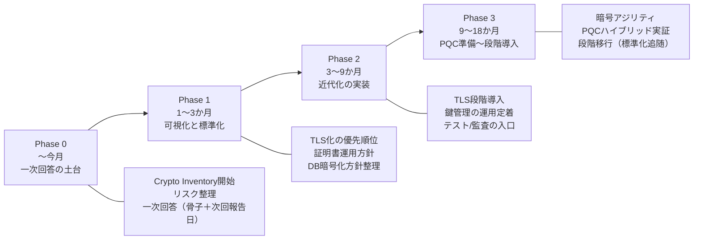

---
# Slidev frontmatter
# See: https://sli.dev/guide/frontmatter.html
layout: cover
theme: seriph

# 見た目チューニング（最小構成）
# - seriphはフォーマル寄りで幹部会向けに相性が良い
# - accentColorは強調色（リンク/装飾）
# - fontsは環境依存するため指定しない（崩れにくさ優先）
style: |
  :root { --slidev-theme-primary: #0F4C81; }

title: "PQC対応に関する現状分析とロードマップ案"
subtitle: "保険販売支援システム（Windows Server / SQL Server / Web / Java1.8 + .NET Framework）"
info: "幹部会向け（社内）"
author: "（作成：PQC対応責任者）"
date: "2026-02-08"
---

# PQC対応に関する現状分析とロードマップ案

- 対象：保険販売支援システム
- 目的：地方銀行からのPQC照会に対する一次回答（今月中）＋社内推進方針の合意

※本資料は「現状把握の結果」と「初期ロードマップ案」。詳細はPhase0で棚卸しの上、更新する。

---
layout: default
---

# 1. 目的（今日の結論）

- 地方銀行より **PQC対応ロードマップの提示**を要請（今月中目処）
- 当社現状：閉域前提で **HTTPS未対応、暗号化が限定的**
- 結論：
  - **PQC“単体”ではなく、暗号基盤の近代化（TLS/鍵管理/DB暗号）を優先**
  - PQCは標準化動向に合わせ **段階導入（ハイブリッド→移行）** として回答

---

# 2. 背景（なぜ今PQCが問われるか）

- 金融分野でPQC対応の機運が高まりつつある（当局・業界動向）
- その一環として、地方銀行がサプライヤにロードマップ提示を求めている可能性
- 当社としては、
  - 顧客要請に対し「回答できる計画」を持つ
  - 将来の監査/更改にも耐える基盤を作る

注：背景は推測を含む。対外回答は「事実＋当社方針＋次回報告」を中心に記載する。

---

# 3. 現状（事実ベース）

- 利用前提：閉域網中心、インターネット非接続
- 技術スタック：
  - Windows Server / SQL Server
  - Webシステム
  - Java 1.8 / .NET Framework / JavaScript
- セキュリティ実態（概況）：
  - Web通信：HTTPS未対応（平文通信の可能性）
  - DB暗号化：一部実施例はあるが、全体方針が未整備
  - 鍵/証明書運用：標準・手順が未整備
- 体制：セキュリティ専門家不在、責任者任命済

---

# 4. PQCをどう捉えるか（誤解の解消）

- PQC（耐量子計算機暗号）は、主に **公開鍵暗号**（鍵交換・署名）の将来置換
- 実務上の論点は「どこで公開鍵暗号を使っているか」
  - TLS（鍵交換）
  - 証明書（認証）
  - 署名（更新ファイル/配布物/ログ等）
  - 鍵管理・更新
- 当社の現状では、PQC以前に **TLS/証明書/鍵管理の基盤不足**

**結論：まず暗号の棚卸し（Crypto Inventory）＋暗号アジリティが最優先**

---

# 5. 対応方針（当社の約束の仕方）

## 対外説明で守ること
- 今月中：現状整理と段階ロードマップ（一次回答）
- 以後：定期更新（例：四半期ごと）

## 言わないこと（後で詰む約束）
- 「PQC全面対応済み」「全面PQCの確約」など断定

## 技術方針（現実的）
- まず **TLS（1.2/1.3）化**、証明書運用、鍵管理の標準化
- 次に **重要データの暗号化方針統一（SQL Server中心）**
- PQCは **ハイブリッド導入を含む実証**を経て段階移行

---

# 6. ロードマップ（全体像）

※期間は前提（顧客要件、更改タイミング、人員、外部支援の有無）により変動。

---

# 6. ロードマップ（詳細：各Phaseの成果物）

## Phase 0：〜今月
- Crypto Inventory（暗号棚卸し）開始
- リスク整理（平文通信・鍵管理・データ保護）
- 地方銀行向け一次回答（骨子＋次回報告日）

## Phase 1：1〜3か月
- TLS化の優先順位付け（外部連携点/管理系を優先）
- 証明書運用方針（発行・更新・失効・監査ログ）
- DB暗号化方針の整理（適用範囲・方式の方向性）

## Phase 2：3〜9か月
- TLS導入（段階展開：外部→管理→主要機能）
- 鍵管理の運用定着、暗号化範囲の拡大
- セキュリティテスト（設定監査・脆弱性診断の入口）

## Phase 3：9〜18か月
- 暗号アジリティ（差し替え可能設計・更新手順）
- PQC：ハイブリッド方式の実証、適用範囲の明確化
- 標準化動向に合わせ段階移行

---

# 7. 体制・進め方（弱点を統制でカバー）

- 推進体制
  - 週次：進捗・課題・依存関係レビュー（責任者主導）
  - 関係者：開発／運用／営業（対外説明）
- 外部支援（スポット可）
  - 暗号/TLS設計レビュー
  - 証明書運用・鍵管理設計
- 進め方
  - 設計レビュー → PoC → 限定導入 → 展開

---

# 8. 主要リスクと対策（幹部が気にする点）

- リスク：レガシー制約
  - Java 1.8 / .NET Frameworkにより、暗号ライブラリ追随・更改が難しい可能性
  - 対策：影響範囲を分割し、PoCで互換性/性能を事前確認

- リスク：閉域要件による検証制約
  - 対策：顧客別要件を棚卸し、導入オプション化

- リスク：人材・知見不足
  - 対策：外部支援スポット＋標準化（手順/禁止事項）で属人化を抑制

---

# 9. 今月中に「見せられる成果物」

- Crypto Inventory（まずは1枚で可）
  - 通信経路／外部連携／管理系／DB接続の一覧
  - 暗号化の有無、優先度
- TLS化の優先順位 Top5（理由付き）
- 証明書運用方針（簡易版）
- SQL Server暗号化方針の方向性（可否整理）
- 2週間単位のPoC計画（環境・対象・評価観点）

---

# 10. 幹部に求める意思決定（本日のゴール）

1) 方針承認：PQC単体ではなく **TLS/鍵管理/DB暗号の近代化を優先**
2) 人員：Phase0/1に最低○名相当をアサイン（兼務可、役割定義）
3) 外部支援：スポット契約の稟議許可（上限/ルート）
4) 対外方針：今月一次回答＋定期更新（例：四半期ごと）

---
layout: end
---

# 付録：地方銀行向け一次回答（骨子）

- 現状：PQC全面適用は未着手（閉域前提で暗号基盤が未整備）
- 方針：暗号棚卸し→TLS/鍵管理/DB暗号の標準化→PQCはハイブリッド実証→段階導入
- 次回：〇月〇日までに更新版ロードマップ提示、以後定期更新

（この付録は社内用。対外文書は法務/営業と整合の上で確定。）

